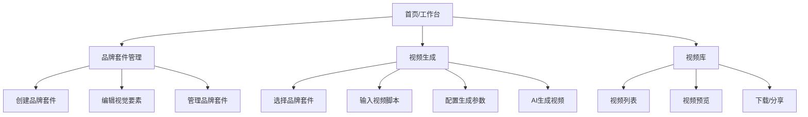
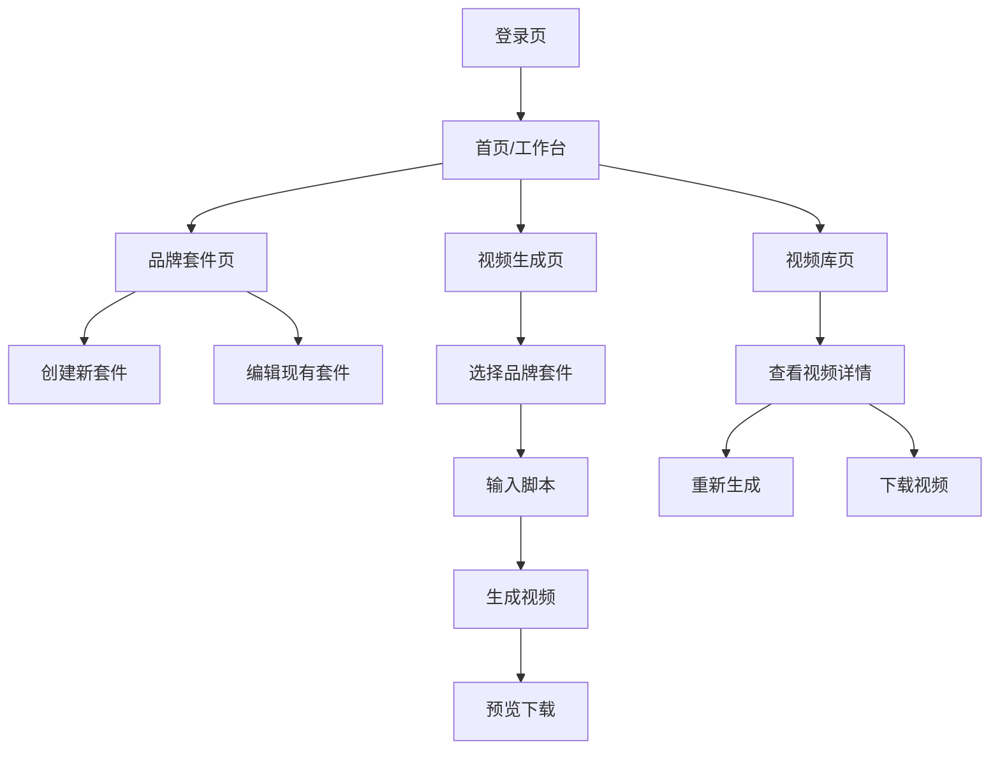
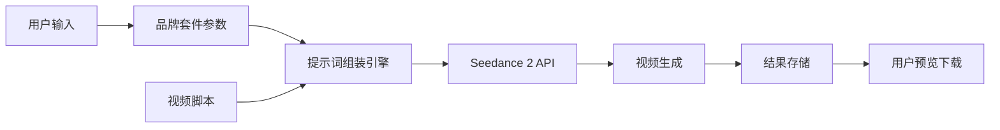
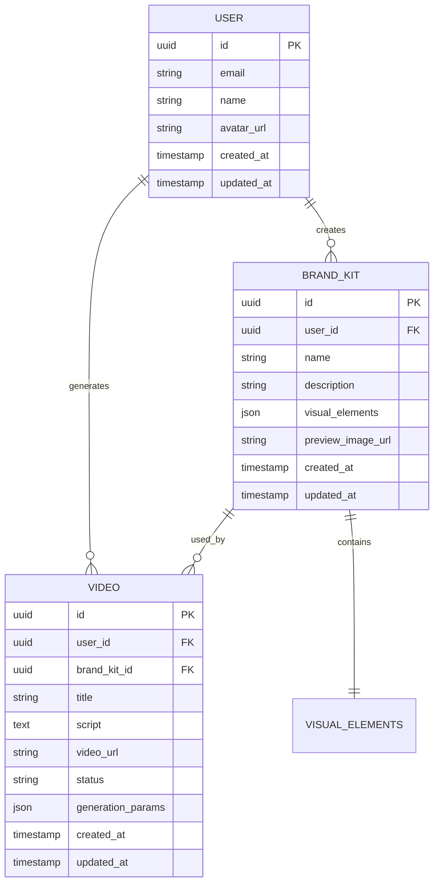

# 视频广告视觉一致性生成平台 - 产品需求文档 (PRD)

## 1. 产品概述

### 1.1 产品简介

视频广告视觉一致性生成平台是一款面向品牌方和广告创作者的AI视频生成工具。用户通过定义10个核心视觉要素来建立品牌视觉规范，系统基于 Seedance 2 模型生成风格统一、品质一致的视频广告内容。

### 1.2 目标用户

| 用户类型      | 描述               | 核心需求               |
| --------- | ---------------- | ------------------ |
| 品牌方/市场团队  | 需要保持品牌视觉一致性的企业用户 | 快速生成符合品牌调性的视频素材    |
| 广告创作者/设计师 | 专业视频制作人员         | 提高工作效率，批量生成风格统一的视频 |
| 电商运营      | 需要大量商品展示视频的商家    | 低成本、高效率产出商品广告      |

### 1.3 产品价值

* **视觉一致性**：通过11个视觉要素的定义，确保所有生成视频保持统一风格

* **效率提升**：AI自动生成视频，大幅降低制作成本和时间

* **品牌资产沉淀**：保存品牌视觉规范，便于团队协作和复用

***

## 2. 核心功能模块

### 2.1 功能架构



### 2.2 页面列表

1. **首页/工作台**：品牌套件快捷入口、最近生成视频、使用统计
2. **品牌套件页**：创建/编辑品牌套件，管理10个视觉要素
3. **视频生成页**：选择品牌套件、输入脚本、配置参数、生成视频
4. **视频库页**：管理已生成视频、预览、下载、删除
5. **登录/注册页**：用户认证

***

## 3. 10个视觉要素详细定义

### 3.1 视觉要素总览

| 要素编号 | 要素名称 | 要素类型 | 录入方式  | 影响范围    |
| ---- | ---- | ---- | ----- | ------- |
| 1    | 材质   | 视觉   | 选择/上传/自定义 | 物体表面质感  |
| 2    | 调色   | 视觉   | 色板/预设/自定义 | 整体色彩风格  |
| 3    | 表情   | 视觉   | 选择/描述/自定义 | 人物面部表情  |
| 4    | 服装   | 视觉   | 选择/上传/自定义 | 人物穿着风格  |
| 5    | 构图   | 视觉   | 选择/图示/自定义 | 画面布局方式  |
| 6    | 妆造   | 视觉   | 选择/描述/自定义 | 化妆造型风格  |
| 7    | 肢体   | 视觉   | 选择/描述/自定义 | 肢体动作姿态  |
| 8    | 台词节奏 | 音频   | 参数调节/自定义 | 语音语速语调  |
| 9    | 剪辑节奏 | 时序   | 参数调节/自定义 | 镜头切换速度  |
| 10   | 音效   | 音频   | 选择/上传/自定义 | 背景音乐/音效 |

### 3.2 各要素详细定义

#### 3.2.1 材质 (Material)

* **定义**：视频中物体表面的质感表现

* **录入方式**：

  * 预设选项：金属、玻璃、木纹、布料、皮革、陶瓷、塑料、石材、纸质、丝绒

  * 自定义上传：支持上传参考图片

  * 描述文本：补充说明材质细节

  * 自定义：支持完全自定义输入或参数配置

* **展示形式**：网格卡片展示，点击选中

#### 3.2.2 调色 (Color Grading)

* **定义**：视频的整体色彩风格和色调倾向

* **录入方式**：

  * 预设风格：暖色调、冷色调、高对比、复古、电影感、清新、暗黑、赛博朋克

  * 自定义色板：主色、辅色、强调色选择器

  * 参考图上传：上传品牌色彩参考图

  * 自定义：支持完全自定义输入或参数配置

* **展示形式**：色板卡片 + 色彩选择器

#### 3.2.3 表情 (Expression)

* **定义**：视频中人物角色的面部表情风格

* **录入方式**：

  * 预设表情：自信微笑、专业严肃、亲和友善、活力热情、沉稳内敛、俏皮可爱

  * 表情强度滑块：0-100% 调节

  * 描述文本：补充表情细节要求

  * 自定义：支持完全自定义输入或参数配置

* **展示形式**：表情图标网格 + 滑块控件

#### 3.2.4 服装 (Costume)

* **定义**：视频中人物的穿着风格

* **录入方式**：

  * 风格预设：商务正装、休闲时尚、运动活力、复古优雅、极简主义、街头潮流

  * 颜色偏好：服装主色调选择

  * 参考图上传：上传服装参考图片

  * 自定义：支持完全自定义输入或参数配置

* **展示形式**：风格卡片 + 色彩选择

#### 3.2.5 构图 (Composition)

* **定义**：画面的布局和视觉组织方式

* **录入方式**：

  * 构图模板：中心构图、三分法、对称构图、引导线、框架构图、留白构图

  * 景别选择：特写、近景、中景、全景、远景

  * 视角选择：平视、俯视、仰视、斜角

  * 自定义：支持完全自定义输入或参数配置

* **展示形式**：构图示意图卡片

#### 3.2.6 妆造 (Makeup)

* **定义**：人物的化妆造型风格

* **录入方式**：

  * 风格预设：自然裸妆、精致全妆、复古妆容、时尚前卫、清新淡妆、专业职场

  * 重点强调：眼妆、唇妆、底妆滑块调节

  * 描述文本：补充妆造细节

  * 自定义：支持完全自定义输入或参数配置

* **展示形式**：风格卡片 + 滑块控件

#### 3.2.7 肢体 (Gesture)

* **定义**：人物的肢体动作和姿态

* **录入方式**：

  * 姿态预设：站姿挺拔、坐姿优雅、动态行走、手势表达、互动姿态、静态展示

  * 动作幅度：微妙/自然/夸张 三档选择

  * 描述文本：补充动作细节

  * 自定义：支持完全自定义输入或参数配置

* **展示形式**：姿态示意图 + 幅度选择器

#### 3.2.8 台词节奏 (Dialogue Rhythm)

* **定义**：配音或对话的语速和语调节奏

* **录入方式**：

  * 语速调节：慢速(0.8x) / 标准(1.0x) / 快速(1.2x)

  * 语调风格：沉稳专业、热情活力、亲切温和、权威可信

  * 声音材质：预设/自定义声音材质（如：磁性、清脆、沙哑等）

  * 停顿节奏：紧凑/标准/舒缓 三档

  * 自定义：支持完全自定义输入或参数配置

* **展示形式**：滑块 + 风格按钮

#### 3.2.9 剪辑节奏 (Editing Rhythm)

* **定义**：视频镜头切换和剪辑的速度节奏

* **录入方式**：

  * 节奏预设：慢节奏(长镜头)、中节奏(标准)、快节奏(快速剪辑)

  * 转场风格：硬切、淡入淡出、滑动、缩放

  * 镜头时长预设：15s / 30s / 45s / 60s

  * 自定义：支持完全自定义输入或参数配置

* **展示形式**：节奏卡片 + 转场选择器

#### 3.2.10 音效 (Sound Effects)

* **定义**：视频的背景音乐和音效

* **录入方式**：

  * 音乐风格：轻快活泼、沉稳大气、科技感、温馨治愈、动感节奏、优雅古典

  * 音量平衡：音乐/人声/音效 比例调节

  * 自定义上传：支持上传自有音频文件

  * 自定义：支持完全自定义输入或参数配置

* **展示形式**：风格卡片 + 音量滑块 + 上传区

***

## 4. 页面结构与用户流程

### 4.1 页面详细设计

#### 4.1.1 首页/工作台

| 模块名称   | 功能描述                            |
| ------ | ------------------------------- |
| 顶部导航   | Logo、主导航（工作台、品牌套件、视频库）、用户头像下拉菜单 |
| 快捷操作区  | 创建品牌套件按钮、生成视频按钮                 |
| 品牌套件卡片 | 展示已创建的品牌套件，显示名称、缩略图、创建时间        |
| 最近生成视频 | 展示最近生成的视频缩略图列表                  |
| 使用统计   | 本月生成视频数量、剩余额度等                  |

#### 4.1.2 品牌套件页（核心页面）

参考 Lovart My Brand Kit 设计风格，采用左侧导航 + 右侧编辑区的布局。

| 模块名称    | 功能描述                   |
| ------- | ---------------------- |
| 页面标题区   | 品牌套件名称编辑、保存/删除按钮       |
| 左侧导航栏   | 10个视觉要素的快速跳转导航         |
| 视觉要素编辑区 | 各要素的具体录入界面             |
| 实时预览区   | 基于当前设置生成的预览效果          |
| 提示词预览   | 展示自动生成的 Seedance 2 提示词 |

**10个要素的组织方式**：

* 视觉组（前7个）：材质、调色、表情、服装、构图、妆造、肢体

* 音频时序组（后3个）：台词节奏、剪辑节奏、音效

#### 4.1.3 视频生成页

| 模块名称   | 功能描述              |
| ------ | ----------------- |
| 品牌套件选择 | 下拉选择或卡片选择已创建的品牌套件 |
| 脚本输入区  | 多行文本框输入视频脚本/描述    |
| 高级参数配置 | 视频时长、分辨率、比例等      |
| 生成按钮   | 开始生成视频            |
| 生成进度   | 显示当前生成状态和进度条      |
| 预览/下载区 | 生成完成后展示视频，提供下载按钮  |

#### 4.1.4 视频库页

| 模块名称   | 功能描述                      |
| ------ | ------------------------- |
| 筛选器    | 按品牌套件、生成时间、视频状态筛选         |
| 视频网格   | 视频缩略图卡片，显示标题、生成时间、使用的品牌套件 |
| 批量操作   | 批量选择、批量删除                 |
| 视频详情弹窗 | 预览视频、查看使用的参数、重新生成、下载      |

### 4.2 核心用户流程

#### 4.2.1 创建品牌套件流程

```
1. 点击"创建品牌套件"按钮
2. 输入品牌套件名称
3. 依次配置10个视觉要素
   - 选择/上传各要素的参数
   - 实时预览效果
4. 查看自动生成的提示词
5. 保存品牌套件
```

#### 4.2.2 生成视频流程

```
1. 进入视频生成页面
2. 选择已创建的品牌套件
3. 输入视频脚本/描述
4. 配置高级参数（可选）
5. 点击生成按钮
6. 等待AI生成完成
7. 预览并下载视频
```

### 4.3 页面导航流程图



***

## 5. UI/UX 设计规范

### 5.1 设计风格（参考 Lovart）

* **整体风格**：现代简约、专业科技感、深色/浅色双主题

* **布局风格**：卡片式布局、左侧固定导航、充足的留白

* **视觉层次**：清晰的层级划分，重要操作突出显示

### 5.2 色彩规范

| 用途     | 颜色值                   | 说明            |
| ------ | --------------------- | ------------- |
| 主色调    | #6366F1 (Indigo-500)  | 品牌色，用于主要按钮和强调 |
| 辅助色    | #8B5CF6 (Violet-500)  | 渐变搭配、次级强调     |
| 成功色    | #10B981 (Emerald-500) | 成功状态、完成提示     |
| 警告色    | #F59E0B (Amber-500)   | 警告提示          |
| 错误色    | #EF4444 (Red-500)     | 错误提示          |
| 背景色-深  | #0F172A (Slate-900)   | 深色主题背景        |
| 背景色-浅  | #FFFFFF               | 浅色主题背景        |
| 文字主色-深 | #F8FAFC (Slate-50)    | 深色主题主文字       |
| 文字主色-浅 | #1E293B (Slate-800)   | 浅色主题主文字       |
| 文字次色   | #64748B (Slate-500)   | 次要文字、描述       |

### 5.3 字体规范

* **字体家族**：Inter / system-ui / -apple-system

* **标题字体**：Inter Bold / 600 weight

* **正文字体**：Inter Regular / 400 weight

* **字号规范**：

  * 页面标题：28-32px

  * 模块标题：20-24px

  * 卡片标题：16-18px

  * 正文：14-16px

  * 辅助文字：12-14px

### 5.4 组件规范

#### 5.4.1 卡片组件

* 圆角：12-16px

* 阴影：柔和投影，0 4px 6px -1px rgba(0,0,0,0.1)

* 悬停效果：轻微上浮 + 阴影加深

#### 5.4.2 按钮组件

* 主要按钮：主色调背景，白色文字，圆角8px

* 次要按钮：透明背景，主色调边框和文字

* 图标按钮：40x40px，圆角8px

#### 5.4.3 输入组件

* 圆角：8px

* 边框：1px solid，聚焦时主色调边框

* 内边距：12px 16px

### 5.5 页面布局规范

| 页面    | 布局结构               | 说明        |
| ----- | ------------------ | --------- |
| 首页    | 顶部导航 + 内容网格        | 响应式卡片网格   |
| 品牌套件页 | 左侧边栏(280px) + 主内容区 | 固定左侧导航    |
| 视频生成页 | 左右分栏               | 左侧配置，右侧预览 |
| 视频库页  | 顶部筛选 + 网格内容        | 瀑布流或规则网格  |

### 5.6 响应式设计

* **桌面优先**：主要面向桌面端用户设计

* **平板适配**：768px-1024px，调整布局为单栏

* **最小支持**：1280px 为最小桌面宽度

***

## 6. 视频生成流程

### 6.1 技术集成方案



### 6.2 提示词组装逻辑

系统将10个视觉要素自动组装为 Seedance 2 可识别的提示词格式：

```
基础提示词结构：
[视频脚本内容] + 
视觉风格：[材质], [调色], [表情], [服装], [构图], [妆造], [肢体] + 
音频时序：[台词节奏], [剪辑节奏], [音效]
```

### 6.3 生成参数配置

| 参数   | 选项                      | 默认值   |
| ---- | ----------------------- | ----- |
| 视频时长 | 5s / 10s / 15s / 30s    | 10s   |
| 分辨率  | 720p / 1080p / 4K       | 1080p |
| 画面比例 | 16:9 / 9:16 / 1:1 / 4:3 | 16:9  |
| 生成数量 | 1-4个变体                  | 1     |

***

## 7. 数据模型定义

### 7.1 实体关系图



### 7.2 数据表定义

#### 7.2.1 用户表 (users)

```sql
CREATE TABLE users (
    id UUID PRIMARY KEY DEFAULT gen_random_uuid(),
    email VARCHAR(255) UNIQUE NOT NULL,
    name VARCHAR(100) NOT NULL,
    avatar_url TEXT,
    created_at TIMESTAMP WITH TIME ZONE DEFAULT NOW(),
    updated_at TIMESTAMP WITH TIME ZONE DEFAULT NOW()
);

GRANT SELECT ON users TO anon;
GRANT ALL PRIVILEGES ON users TO authenticated;
```

#### 7.2.2 品牌套件表 (brand\_kits)

```sql
CREATE TABLE brand_kits (
    id UUID PRIMARY KEY DEFAULT gen_random_uuid(),
    user_id UUID NOT NULL REFERENCES users(id) ON DELETE CASCADE,
    name VARCHAR(100) NOT NULL,
    description TEXT,
    visual_elements JSONB NOT NULL DEFAULT '{}',
    preview_image_url TEXT,
    created_at TIMESTAMP WITH TIME ZONE DEFAULT NOW(),
    updated_at TIMESTAMP WITH TIME ZONE DEFAULT NOW()
);

CREATE INDEX idx_brand_kits_user_id ON brand_kits(user_id);
CREATE INDEX idx_brand_kits_created_at ON brand_kits(created_at DESC);

GRANT SELECT ON brand_kits TO anon;
GRANT ALL PRIVILEGES ON brand_kits TO authenticated;
```

**visual\_elements JSONB 结构示例**：

```json
{
  "material": {
    "preset": "metal",
    "custom_image": null,
    "description": "高光泽金属质感"
  },
  "color_grading": {
    "preset": "cinematic",
    "primary_color": "#6366F1",
    "secondary_color": "#8B5CF6",
    "accent_color": "#EC4899"
  },
  "expression": {
    "preset": "confident_smile",
    "intensity": 75,
    "description": "自信且亲和"
  },
  "costume": {
    "preset": "business_formal",
    "primary_color": "#1E293B",
    "custom_image": null
  },
  "composition": {
    "template": "rule_of_thirds",
    "shot_size": "medium",
    "angle": "eye_level"
  },
  "makeup": {
    "preset": "natural",
    "emphasis": {
      "eyes": 60,
      "lips": 40,
      "base": 50
    }
  },
  "gesture": {
    "preset": "standing_confident",
    "magnitude": "natural",
    "description": "双手自然交叠"
  },
  "dialogue_rhythm": {
    "speed": "1.0x",
    "tone": "professional",
    "voice_texture": "magnetic",
    "pause": "standard"
  },
  "editing_rhythm": {
    "pace": "medium",
    "transition": "fade",
    "shot_duration": "15s"
  },
  "sound_effects": {
    "music_style": "upbeat",
    "volume_balance": {
      "music": 40,
      "voice": 80,
      "effects": 50
    },
    "custom_audio": null
  }
}
```

#### 7.2.3 视频表 (videos)

```sql
CREATE TABLE videos (
    id UUID PRIMARY KEY DEFAULT gen_random_uuid(),
    user_id UUID NOT NULL REFERENCES users(id) ON DELETE CASCADE,
    brand_kit_id UUID REFERENCES brand_kits(id) ON DELETE SET NULL,
    title VARCHAR(200) NOT NULL,
    script TEXT NOT NULL,
    video_url TEXT,
    status VARCHAR(20) NOT NULL DEFAULT 'pending',
    generation_params JSONB DEFAULT '{}',
    created_at TIMESTAMP WITH TIME ZONE DEFAULT NOW(),
    updated_at TIMESTAMP WITH TIME ZONE DEFAULT NOW()
);

CREATE INDEX idx_videos_user_id ON videos(user_id);
CREATE INDEX idx_videos_brand_kit_id ON videos(brand_kit_id);
CREATE INDEX idx_videos_status ON videos(status);
CREATE INDEX idx_videos_created_at ON videos(created_at DESC);

GRANT SELECT ON videos TO anon;
GRANT ALL PRIVILEGES ON videos TO authenticated;
```

**generation\_params JSONB 结构示例**：

```json
{
  "duration": 10,
  "resolution": "1080p",
  "aspect_ratio": "16:9",
  "variations": 1,
  "seedance_prompt": "完整组装后的提示词"
}
```

### 7.3 行级安全策略 (RLS)

```sql
-- brand_kits 表 RLS
ALTER TABLE brand_kits ENABLE ROW LEVEL SECURITY;

CREATE POLICY "Users can view own brand kits" 
ON brand_kits FOR SELECT 
TO authenticated 
USING (user_id = auth.uid());

CREATE POLICY "Users can insert own brand kits" 
ON brand_kits FOR INSERT 
TO authenticated 
WITH CHECK (user_id = auth.uid());

CREATE POLICY "Users can update own brand kits" 
ON brand_kits FOR UPDATE 
TO authenticated 
USING (user_id = auth.uid())
WITH CHECK (user_id = auth.uid());

CREATE POLICY "Users can delete own brand kits" 
ON brand_kits FOR DELETE 
TO authenticated 
USING (user_id = auth.uid());

-- videos 表 RLS
ALTER TABLE videos ENABLE ROW LEVEL SECURITY;

CREATE POLICY "Users can view own videos" 
ON videos FOR SELECT 
TO authenticated 
USING (user_id = auth.uid());

CREATE POLICY "Users can insert own videos" 
ON videos FOR INSERT 
TO authenticated 
WITH CHECK (user_id = auth.uid());

CREATE POLICY "Users can update own videos" 
ON videos FOR UPDATE 
TO authenticated 
USING (user_id = auth.uid())
WITH CHECK (user_id = auth.uid());

CREATE POLICY "Users can delete own videos" 
ON videos FOR DELETE 
TO authenticated 
USING (user_id = auth.uid());
```

***

## 8. 非功能性需求

### 8.1 性能要求

* 页面首屏加载时间 < 2s

* 品牌套件保存响应时间 < 500ms

* 视频生成状态轮询间隔 5s

### 8.2 安全要求

* 用户认证使用 Supabase Auth

* 所有API请求需要身份验证

* 文件上传限制类型和大小

### 8.3 兼容性要求

* 支持 Chrome、Firefox、Safari、Edge 最新两个版本

* 不支持 IE 浏览器

***

## 9. 附录

### 9.1 参考链接

* Lovart Brand Kit: <https://www.lovart.ai/brand-kit>

* Seedance 2 API 文档: \[待补充]

### 9.2 术语表

| 术语         | 说明              |
| ---------- | --------------- |
| 品牌套件       | 包含10个视觉要素配置的集合  |
| Seedance 2 | 视频生成AI模型        |
| 提示词        | 用于指导AI生成视频的文本描述 |
| 视觉要素       | 影响视频视觉风格的10个维度  |

