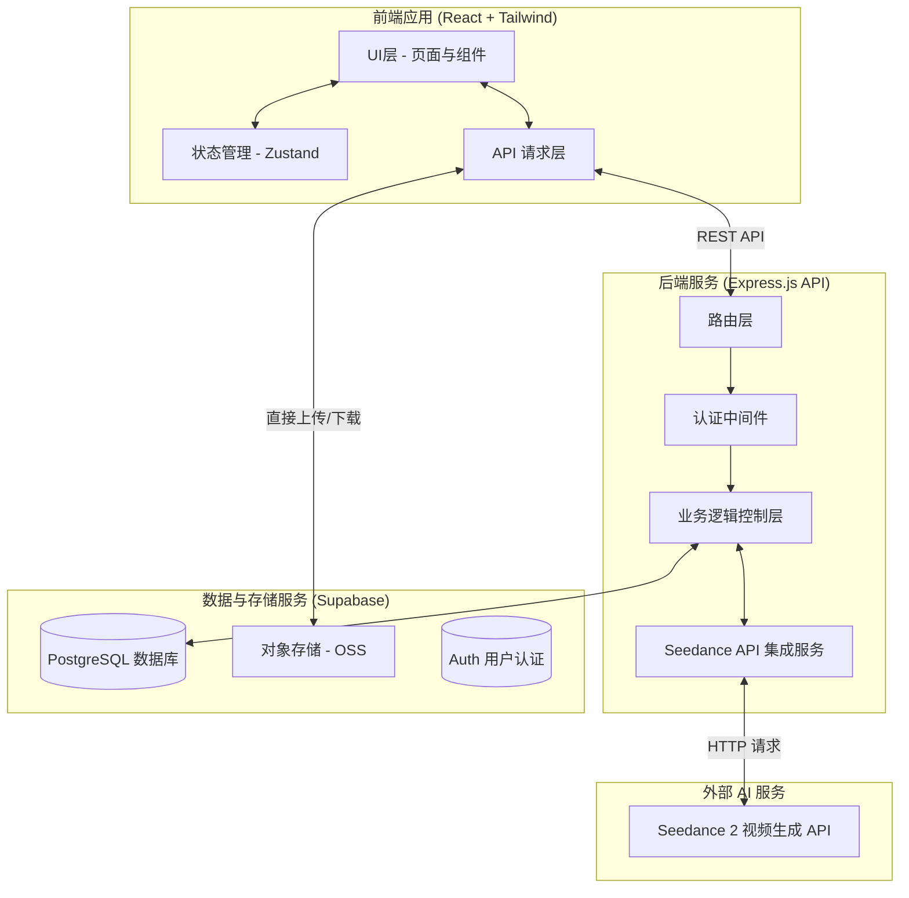

# 视频广告视觉一致性生成平台 - 技术架构文档

## 1. 技术栈选型

### 1.1 前端 (Frontend)
*   **核心框架**: React 18
*   **开发语言**: TypeScript
*   **构建工具**: Vite
*   **路由管理**: React Router v6
*   **状态管理**: Zustand (用于全局状态如用户登录、品牌套件数据)
*   **样式方案**: Tailwind CSS
*   **UI 组件库**: Radix UI (Headless) + 自定义 Tailwind 组件 (参考 Lovart 风格)
*   **API 请求**: Axios 或 React Query

### 1.2 后端 (Backend)
*   **核心框架**: Node.js + Express.js
*   **开发语言**: TypeScript
*   **数据库**: PostgreSQL (使用 Supabase 托管)
*   **对象存储**: Supabase Storage (用于存储上传的参考图、音频等素材和生成的视频)
*   **身份认证**: Supabase Auth
*   **API 风格**: RESTful API

### 1.3 AI 视频生成 (AI Model Integration)
*   **核心模型**: Seedance 2 模型 API
*   **集成方式**: 后端异步调用 (Webhook/长轮询机制)

---

## 2. 系统架构图



---

## 3. 前端组件架构

### 3.1 页面级组件 (Pages)
*   `Dashboard`: 首页/工作台，展示套件列表和统计。
*   `BrandKitEditor`: 品牌套件编辑页 (包含左侧导航和右侧编辑区)。
*   `VideoGenerator`: 视频生成页 (左侧输入脚本，右侧预览)。
*   `VideoLibrary`: 视频库页。

### 3.2 核心业务组件 (Features)
*   `VisualElementForm`: 10个视觉要素的通用表单封装组件。
*   `ElementNav`: 品牌套件页的左侧 10 个要素导航菜单。
*   `PromptPreview`: 实时组装和展示 Seedance 提示词的预览组件。
*   `GenerationProgress`: 视频生成进度展示组件。

### 3.3 基础 UI 组件 (Shared UI)
*   `Card`, `Button`, `Input`, `Select`, `Slider`, `ColorPicker`, `ImageUploader`, `AudioUploader`。

---

## 4. API 接口设计 (Express.js)

### 4.1 品牌套件管理 (Brand Kits)
*   `GET /api/brand-kits`：获取用户的品牌套件列表
*   `POST /api/brand-kits`：创建新的品牌套件 (包含 10 个视觉要素的 JSON 数据)
*   `GET /api/brand-kits/:id`：获取单个品牌套件详情
*   `PUT /api/brand-kits/:id`：更新品牌套件
*   `DELETE /api/brand-kits/:id`：删除品牌套件

### 4.2 视频生成与管理 (Videos)
*   `POST /api/videos/generate`：提交视频生成任务
    *   *Body*: `{ brandKitId, script, duration, resolution }`
*   `GET /api/videos`：获取用户的视频库列表
*   `GET /api/videos/:id`：获取特定视频的状态和详情
*   `DELETE /api/videos/:id`：删除生成的视频

---

## 5. Seedance 2 集成方案

### 5.1 提示词自动组装逻辑 (Backend Service)
后端接收到 `generate` 请求后，读取 `brandKitId` 对应的 10 个视觉要素数据，结合用户输入的 `script` (脚本)，拼装成最终发给 Seedance 2 的 Prompt。

**组装规则示例**：
```text
[用户脚本]
视觉风格设定:
- 材质: [材质设定，包括自定义描述]
- 调色: [调色预设/色板，包括自定义描述]
- 表情: [表情设定，包括自定义描述]
- 服装: [服装设定，包括自定义描述]
- 构图: [构图设定，包括自定义描述]
- 妆造: [妆造设定，包括自定义描述]
- 肢体: [肢体设定，包括自定义描述]

音频与时序设定:
- 台词节奏: 语速[X]，语调[Y]，声音材质[Z]，[自定义描述]
- 剪辑节奏: 节奏[X]，转场[Y]，镜头时长[15s/30s/45s/60s]，[自定义描述]
- 音效: 音乐风格[X]，[自定义描述]
```

### 5.2 异步生成机制
1. 前端调用 `POST /api/videos/generate`。
2. 后端 Express.js 组装提示词，调用 Seedance 2 API 发起生成任务。
3. 后端在数据库中创建一条 `status='generating'` 的视频记录，并返回 `videoId` 给前端。
4. 后端通过轮询 Seedance 2 API (或接收 Webhook) 更新视频状态和最终的 `video_url`。
5. 前端通过轮询 `GET /api/videos/:id` 获取最新状态，完成后展示视频。

---

## 6. 数据库模型设计 (PostgreSQL)

详细表结构定义参考 PRD 文档。以下为核心表概览：

1.  **users**: 存储用户信息。
2.  **brand_kits**: 存储品牌套件基本信息和 `visual_elements` (JSONB格式，包含10个要素的具体配置)。
3.  **videos**: 存储生成的视频记录，包含引用的 `brand_kit_id`、用户输入的脚本、状态 (`pending`, `generating`, `completed`, `failed`) 和生成的视频链接。

---

## 7. 项目目录结构

```text
/ad
├── frontend/                 # React 前端应用
│   ├── public/
│   ├── src/
│   │   ├── assets/           # 静态资源
│   │   ├── components/       # 公共 UI 组件
│   │   ├── features/         # 业务组件 (BrandKit, VideoGen 等)
│   │   ├── hooks/            # 自定义 React Hooks
│   │   ├── pages/            # 页面组件
│   │   ├── services/         # API 请求层
│   │   ├── store/            # Zustand 状态管理
│   │   ├── types/            # TypeScript 类型定义
│   │   ├── utils/            # 工具函数
│   │   ├── App.tsx
│   │   └── main.tsx
│   ├── tailwind.config.js    # Tailwind 样式配置
│   └── package.json
│
├── backend/                  # Express.js 后端应用
│   ├── src/
│   │   ├── config/           # 环境变量与配置
│   │   ├── controllers/      # 路由控制器
│   │   ├── middlewares/      # 认证、错误处理中间件
│   │   ├── routes/           # API 路由定义
│   │   ├── services/         # Seedance 集成等核心业务逻辑
│   │   ├── utils/            # 工具函数
│   │   └── index.ts          # 入口文件
│   ├── package.json
│   └── tsconfig.json
│
└── .trae/
    └── documents/
        ├── PRD.md
        └── Technical-Architecture.md
```