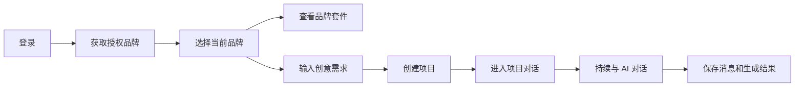
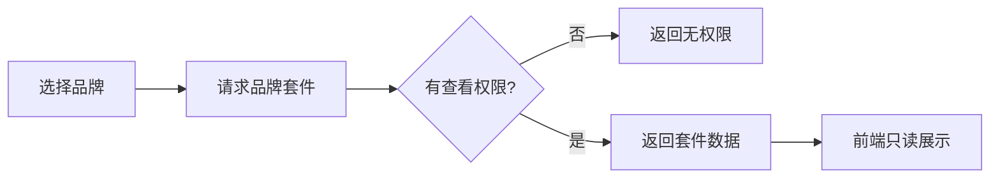
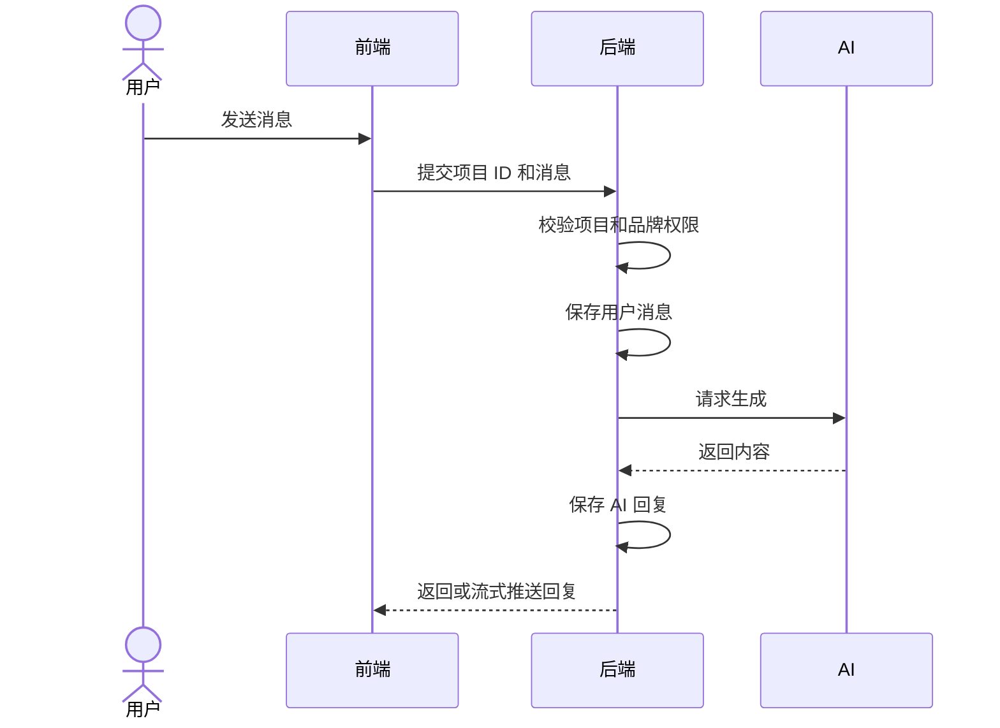

# MICHI 后端逻辑简版

## 1. 产品目标

MICHI 是一个基于企业品牌套件生成创意内容的 AI 工作台。

系统的核心关系是：

> 用户登录后，只能查看被授权的品牌，并且只能为有生成权限的品牌产出创意。

---

## 2. 核心业务关系

```text
用户
  └─ 被授权使用一个或多个品牌
       └─ 每个品牌拥有独立的：
          - 企业品牌套件
          - Skill
          - 项目
          - 对话消息
          - 生成结果
```

不同品牌的数据必须完全隔离。

---

## 3. 用户完整流程



具体步骤：

1. 用户输入账号和密码。
2. 后端验证用户身份。
3. 后端返回用户可以访问的品牌。
4. 用户选择一个品牌。
5. 系统加载该品牌的套件、Skill 和项目。
6. 用户输入需求并开始生成。
7. 后端创建项目和第一条消息。
8. 用户进入项目对话页。
9. 用户可以继续发送消息。
10. 所有项目、消息和生成结果由后端保存。

---

## 4. 登录与品牌权限

### 登录成功后返回

- 用户信息。
- 登录凭证。
- 用户可以查看的品牌。
- 用户对每个品牌的权限。
- 默认品牌。

### 品牌权限

| 权限 | 作用 |
| --- | --- |
| 查看 | 查看品牌套件和品牌项目 |
| 生成 | 为该品牌创建项目和生成内容 |
| 管理 | 在管理后台维护品牌套件 |

### 权限规则

- 没有查看权限：不显示该品牌。
- 有查看权限但没有生成权限：只能查看，不能生成。
- 有生成权限：可以创建项目并与 AI 对话。
- 所有接口都必须在后端校验权限。
- 前端隐藏按钮不能代替后端权限校验。

---

## 5. 企业品牌套件

### 重要要求

企业品牌套件必须由后端录入和保存。

普通用户在当前网页中只能查看，不能编辑。

### 套件内容

- 品牌名称。
- 品牌 Logo。
- 品牌主题色。
- 标识和标识排版。
- 标识应用规范。
- 品牌色彩。
- 品牌字体。
- 联合应用规范。
- VI 衍生物。
- 尺寸规范。
- 风格规范。

### 存储方式

- 结构化信息保存在数据库。
- 图片、文档等文件保存在对象存储。
- 数据库保存文件地址和文件信息。
- 品牌套件应支持版本记录。

### 页面流程



---

## 6. 生成页

用户可以：

- 输入创意需求。
- 选择生成类型。
- 选择当前品牌可用的 Skill。
- 取消已选择的 Skill。
- 添加参考文件。
- 点击“开始生成”。
- 点击“新建项目”创建空白对话。

### 开始生成

后端需要：

1. 校验用户是否有当前品牌的生成权限。
2. 校验 Skill 是否属于当前品牌。
3. 创建项目。
4. 保存第一条用户消息。
5. 创建 AI 生成任务。
6. 返回项目 ID。
7. 开始生成 AI 回复。

### 新建空白项目

后端只创建一个草稿项目，不创建消息。

---

## 7. 项目对话

一个项目就是一个持续对话。

用户发送后续消息时，不应创建新项目。

### 对话流程



### 后端需要保存

- 项目标题。
- 所属品牌。
- 创建用户。
- 用户消息。
- AI 回复。
- 使用的 Skill。
- 生成任务状态。
- 生成文件。
- 创建时间和更新时间。

---

## 8. 我的项目

“我的项目”直接显示在左侧栏，不需要独立项目页面。

### 展示规则

- 只展示当前品牌的项目。
- 默认按更新时间倒序排列。
- 新项目显示在最上方。
- 新消息产生后，项目移动到最上方。
- 项目列表支持展开和收起。
- 点击项目直接进入项目对话。

---

## 9. 品牌切换

切换品牌后，需要重新加载：

- 企业品牌套件。
- 品牌 Skill。
- 左侧项目列表。
- 生成页最近项目。

### 限制

- 项目创建后必须固定所属品牌。
- 不能把已有项目直接改到其他品牌。
- 项目对话页建议只显示所属品牌，不允许直接切换。

---

## 10. 核心数据表

| 数据表 | 作用 |
| --- | --- |
| `users` | 用户账号 |
| `brands` | 品牌信息 |
| `user_brand_permissions` | 用户与品牌权限 |
| `brand_kit_elements` | 品牌套件结构 |
| `brand_assets` | 品牌图片和文件 |
| `skills` | Skill 定义 |
| `brand_skills` | 品牌可用 Skill |
| `projects` | 项目 |
| `messages` | 对话消息 |
| `generation_tasks` | AI 生成任务 |
| `outputs` | 生成文件和结果 |

### 必须关联品牌的数据

以下数据必须关联 `brand_id`：

- 品牌套件。
- 品牌资产。
- 项目。
- Skill 配置。
- 生成任务。
- 生成结果。

消息通过项目继承品牌。

---

## 11. 核心接口

### 登录

| 方法 | 接口 | 作用 |
| --- | --- | --- |
| POST | `/api/auth/login` | 登录 |
| POST | `/api/auth/logout` | 退出 |
| GET | `/api/me` | 获取当前用户 |
| GET | `/api/me/brands` | 获取授权品牌 |

### 品牌

| 方法 | 接口 | 作用 |
| --- | --- | --- |
| GET | `/api/brands/:brandId/kit` | 获取品牌套件 |
| GET | `/api/brands/:brandId/skills` | 获取品牌 Skill |

### 项目

| 方法 | 接口 | 作用 |
| --- | --- | --- |
| GET | `/api/projects?brandId=:brandId` | 获取品牌项目 |
| POST | `/api/projects` | 创建项目 |
| GET | `/api/projects/:projectId` | 获取项目和对话 |
| PATCH | `/api/projects/:projectId` | 修改项目名称 |
| DELETE | `/api/projects/:projectId` | 删除或归档项目 |
| POST | `/api/projects/:projectId/messages` | 发送消息 |

---

## 12. 必须校验的规则

每个后端接口都需要确认：

1. 用户是否已登录。
2. 用户是否有该品牌权限。
3. 项目是否属于该品牌。
4. Skill 是否属于该品牌。
5. 用户是否有生成权限。
6. 文件是否属于该项目或品牌。

禁止只依赖前端传入的品牌 ID 或项目 ID。

---

## 13. 当前原型需要替换的部分

| 当前前端原型 | 正式后端实现 |
| --- | --- |
| 固定测试账号 | 正式登录与会话 |
| 固定品牌列表 | 按用户权限返回品牌 |
| 前端品牌 mock 数据 | 后端录入和存储 |
| 前端 Skill 数据 | 后端按品牌返回 |
| `localStorage` 保存项目 | 数据库存储项目 |
| 页面内保存消息 | 数据库存储消息 |
| 模拟 AI 回复 | 接入真实 AI 服务 |

---

## 14. 后端完成标准

- 用户登录后只能看到被授权品牌。
- 用户只能为有生成权限的品牌生成内容。
- 企业品牌套件可以在后台录入和存储。
- 前台品牌套件页面只读。
- 不同品牌的套件、Skill 和项目完全隔离。
- 新建项目后立即出现在左侧项目列表。
- 一个项目支持持续对话。
- 项目、消息和生成结果刷新后不会丢失。
- 所有项目接口都进行品牌权限校验。
- AI 失败时可以显示失败状态并支持重试。
