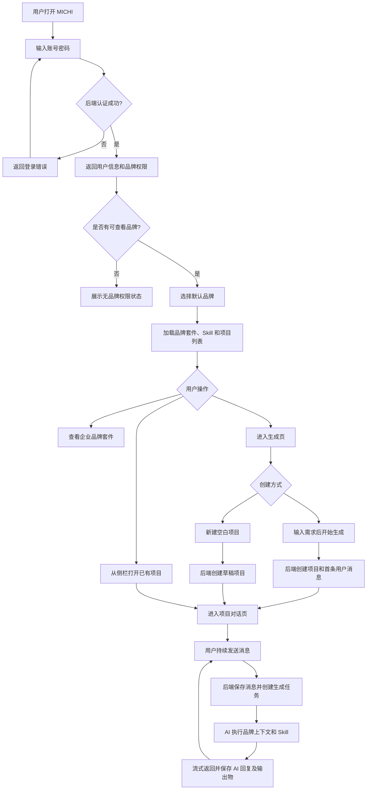
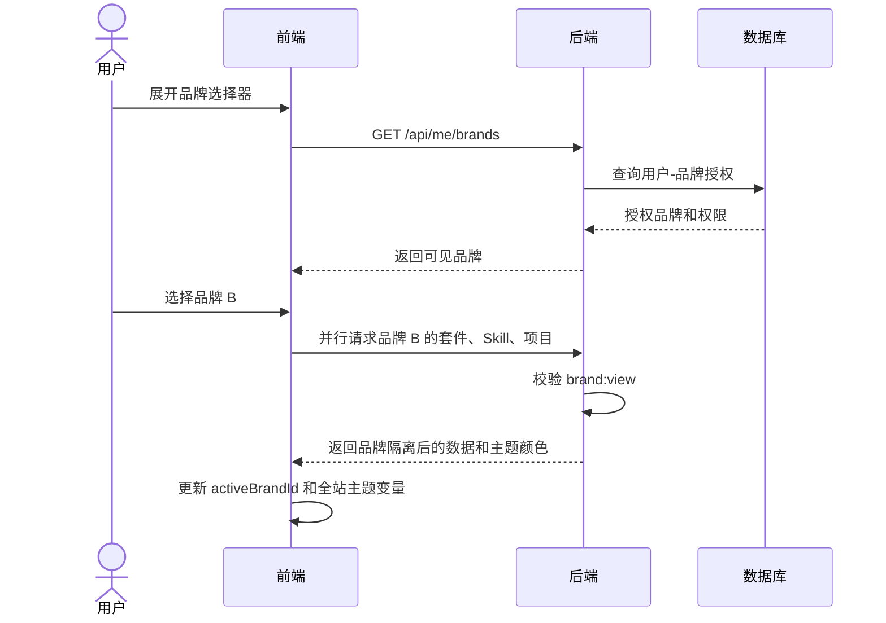
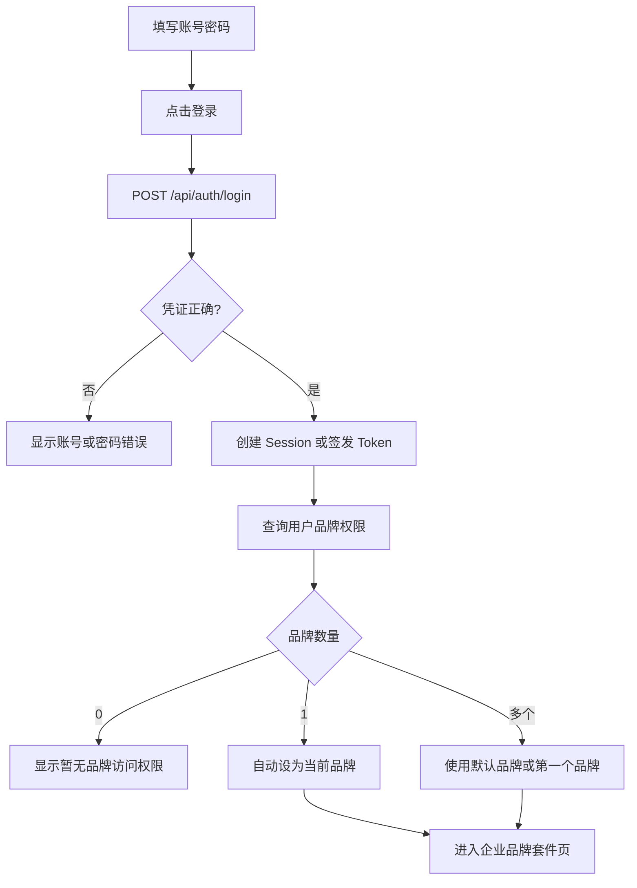
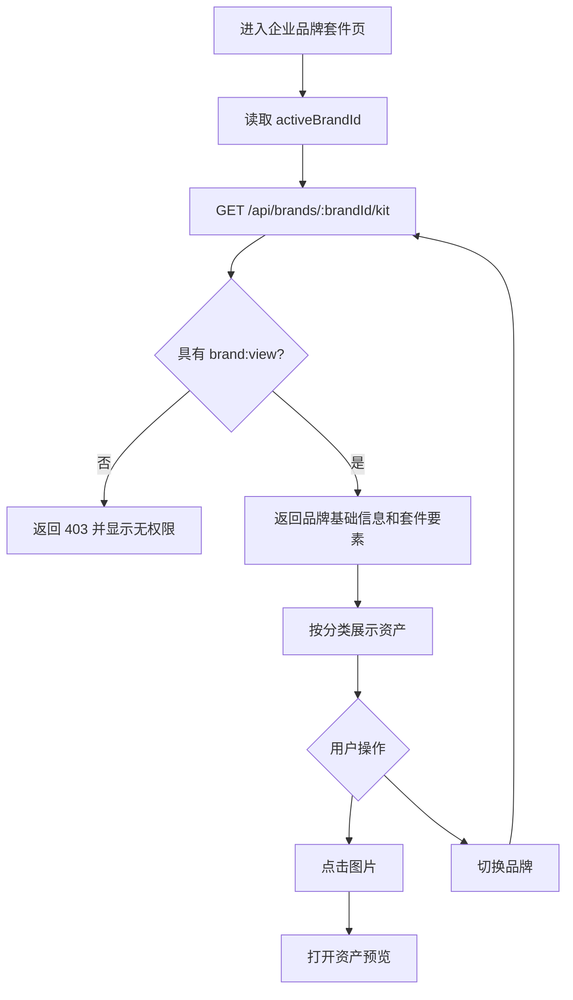
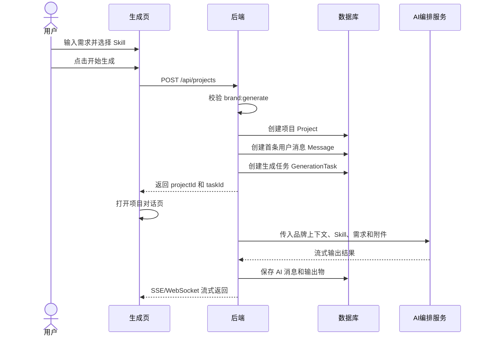
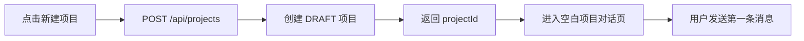
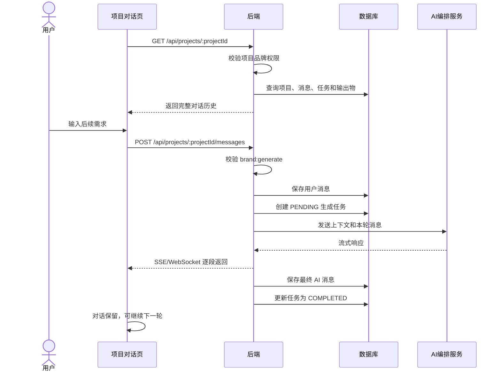
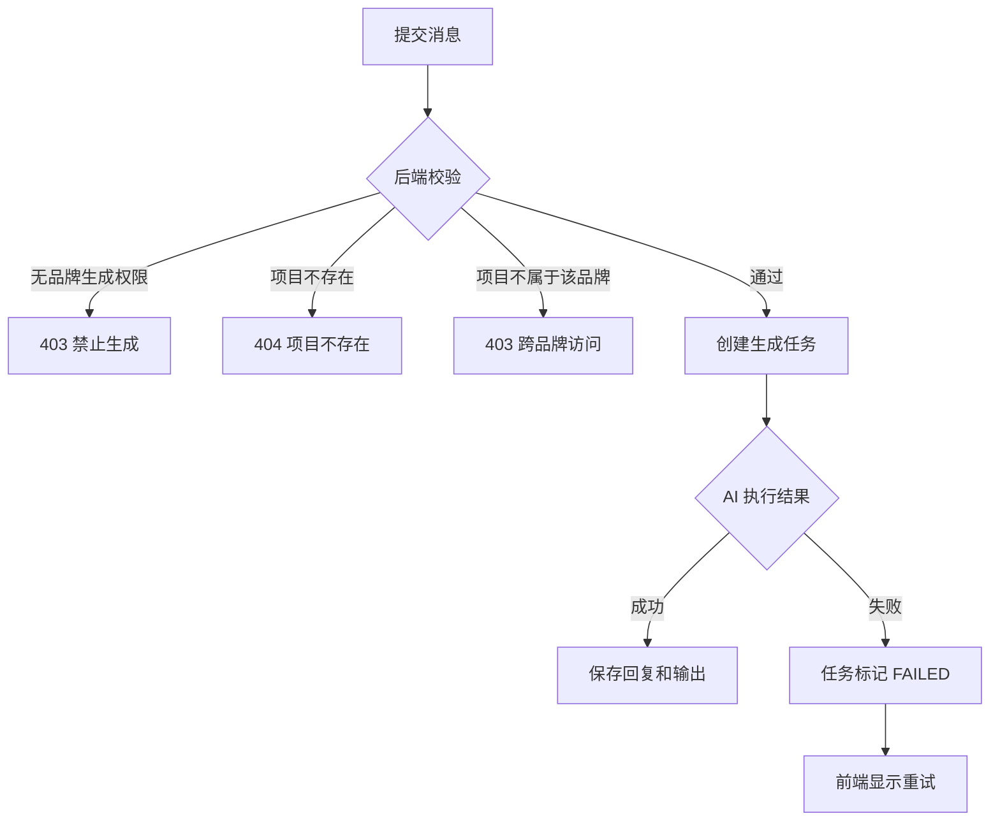
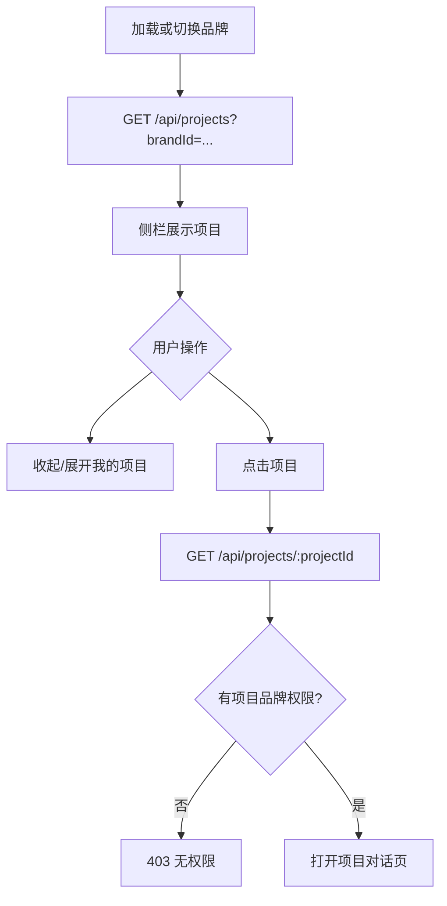
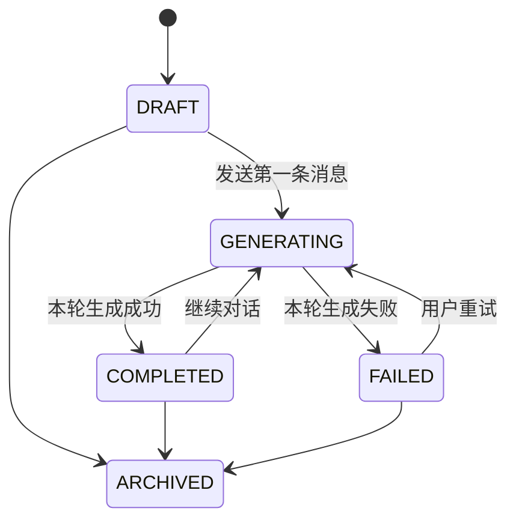

# MICHI 后端系统逻辑说明

## 1. 文档目的

本文面向 MICHI 后端、算法和权限系统开发人员，定义：

- 用户从登录到生成创意、持续对话、查看项目的完整流程。
- 各页面与后端之间的交互逻辑。
- 企业品牌套件的录入、存储、授权和使用规则。
- 项目、消息、Skill、生成任务和输出物的核心数据关系。
- 后端接口、权限校验及状态管理建议。

> 当前网页是前端原型。登录、项目持久化、AI 回复等部分仍为模拟或浏览器本地状态。正式环境必须以后端数据库、鉴权结果和服务端权限校验为唯一可信来源。

---

## 2. 核心业务原则

### 2.1 品牌套件是最高层级上下文

企业品牌套件是所有创意生产数据的顶层归属。以下数据都必须关联 `brand_id`：

- 品牌资产和品牌规范。
- 可使用的 Skill。
- 项目和对话消息。
- 用户上传的参考文件。
- AI 生成任务与生成结果。
- 输出文件和操作日志。

用户切换品牌后，页面只能展示和操作该品牌下的数据。

### 2.2 企业品牌套件由后端录入和维护

企业品牌套件不是普通用户在当前网页中创建或编辑的内容。

品牌套件应由后台管理系统、运营后台或受控导入流程录入，包括：

- 品牌基础信息：名称、Logo、状态、主题色。
- 视觉要素：标识、标识排版、标识应用规范、色彩、字体、联合应用、VI 衍生物。
- 物料规范：尺寸规范、风格规范。
- 品牌相关 Skill。
- 资产文件及其版本。

前台“企业品牌套件”页面只读展示后端返回的数据。

### 2.3 品牌颜色驱动网站主题

后台录入品牌时，必须同时录入品牌主题颜色。建议至少包含：

- `primary_color`：主色，用于主要按钮、选中态、文字高亮和焦点状态。
- `secondary_color`：辅助色，用于渐变、辅助高亮和装饰元素。
- `tertiary_color`：可选高光色，用于文字扫光或渐变过渡。

前端选择品牌后，应使用后端返回的颜色配置更新全站主题。需要变化的元素包括：

- 按钮和按钮渐变。
- 导航及项目选中态。
- 图标、文字高亮和链接。
- 边框、焦点框、阴影和背景光晕。
- 生成状态和对话中的品牌强调色。

品牌颜色必须由后端品牌数据驱动，不应只在前端写死品牌名称与颜色的对应关系。后端应校验颜色格式，前端应保证文字与背景有足够对比度。

### 2.4 登录权限决定用户可见品牌和可产出品牌

用户登录后，后端必须返回其品牌授权范围。一个用户可以被授权多个品牌，并且每个品牌可以有不同权限。

建议权限至少拆分为：

| 权限 | 说明 |
| --- | --- |
| `brand:view` | 查看品牌套件和品牌项目 |
| `brand:generate` | 在品牌下创建项目、发送消息和生成创意 |
| `brand:manage` | 管理品牌资料、资产和 Skill，仅后台角色使用 |

规则：

1. 用户只能看到具有 `brand:view` 权限的品牌。
2. 用户只能在具有 `brand:generate` 权限的品牌下创建项目和生成创意。
3. 品牌选择器只返回当前用户有权查看的品牌。
4. 前端隐藏按钮不能替代服务端鉴权，每个接口都必须再次校验用户与品牌的关系。
5. 项目归属品牌创建后原则上不可直接修改，避免消息、资产和输出跨品牌污染。

---

## 3. 用户整体使用流程



---

## 4. 全局页面结构

### 4.1 左侧栏

左侧栏包含：

- MICHI Logo。
- 企业品牌套件入口。
- 生成入口。
- 可收起/展开的“我的项目”列表。
- 用户头像和退出登录。

“我的项目”不是独立汇总页面，项目直接按当前品牌罗列在侧栏中。点击项目直接打开项目对话。

### 4.2 顶部品牌选择器

企业品牌套件页、生成页和项目对话页右上角都展示统一品牌选择器。

品牌选择器中的品牌列表必须来自登录用户权限，不可返回系统全部品牌。



切换品牌时：

- 清空不属于新品牌的临时 Skill 选择。
- 侧栏项目列表切换为新品牌项目。
- 生成页最近项目切换为新品牌项目。
- 企业品牌套件页切换为新品牌资产。
- 如果用户正在项目对话中，不建议允许直接改变项目品牌。可提示返回后切换，或把品牌选择器设为只读。

---

## 5. 页面交互逻辑

## 5.1 登录页

### 页面职责

- 收集账号与密码。
- 调用后端登录接口。
- 获取用户信息、会话凭证和品牌权限。
- 根据权限选择默认品牌并进入系统。

### 交互逻辑图



### 后端要求

- 密码必须哈希存储，禁止明文。
- 推荐使用 HttpOnly、Secure、SameSite Cookie 保存会话。
- 登录响应可包含用户资料和品牌权限摘要。
- 退出登录必须使服务端 Session/Token 失效。

---

## 5.2 企业品牌套件页

### 页面职责

- 只读展示当前品牌套件。
- 展示视觉要素和物料规范。
- 支持查看品牌资产大图。
- 支持切换用户有权访问的品牌。

### 交互逻辑图



### 后端录入与存储要求

企业套件必须在后端录入和存储，前端不直接修改。建议支持：

- 品牌状态：`ACTIVE`、`INACTIVE`、`ARCHIVED`。
- 品牌主题颜色：主色、辅助色和可选高光色。
- 资产分类和排序。
- 文件元数据、存储地址、缩略图地址。
- 资产版本号、生效时间和操作人。
- JSON 型结构化配置，例如色值、字体和尺寸规范。
- 对象存储中的原文件，数据库中保存元数据与引用。

---

## 5.3 生成页

### 页面职责

- 在当前品牌上下文中输入创意需求。
- 选择能力类型。
- 选择当前品牌可用的 Skill，并支持取消。
- 添加参考附件。
- 创建带首条消息的新项目，或创建空白项目。
- 展示当前品牌最近项目。

### 开始生成交互图



### 新建空白项目交互图



### Skill 规则

- `GET /api/brands/:brandId/skills` 只返回当前品牌已启用的 Skill。
- 用户选中 Skill 后可点击关闭按钮取消。
- 创建项目或发送消息时，前端提交 `skill_id`，后端必须验证该 Skill 是否属于当前品牌且处于启用状态。
- 后端不能信任前端提交的 Skill 名称，必须使用稳定 ID。

---

## 5.4 项目对话页

### 页面职责

- 展示一个项目中的连续用户消息和 AI 回复。
- 支持用户持续发送消息。
- 展示生成中状态。
- 支持流式接收 AI 回复。
- 自动保存消息、任务状态和输出文件。

一个项目就是一个持续对话，不应每轮消息创建新项目。

### 对话交互逻辑图



### 异常处理



### 品牌切换限制

项目创建后已绑定品牌。项目对话页右上角品牌选择器建议：

- 方案 A（推荐）：项目页显示品牌但禁止切换。
- 方案 B：允许选择其他品牌，但选择后退出当前项目并进入新品牌生成页。

禁止直接把已有项目的 `brand_id` 改为另一个品牌。

---

## 5.5 侧栏“我的项目”

### 页面职责

- 展示当前品牌下的项目列表。
- 支持收起和展开。
- 点击项目直接打开项目对话。
- 当前项目显示选中状态。

### 交互逻辑图



项目排序建议默认按 `updated_at DESC`。新建项目和新消息成功后，应把对应项目移动到列表顶部。

---

## 6. 推荐数据模型

## 6.1 用户与权限

### `users`

| 字段 | 类型 | 说明 |
| --- | --- | --- |
| `id` | UUID | 用户 ID |
| `email` | VARCHAR UNIQUE | 登录账号 |
| `password_hash` | VARCHAR | 密码哈希 |
| `name` | VARCHAR | 用户名 |
| `avatar_url` | VARCHAR | 头像 |
| `status` | ENUM | ACTIVE / DISABLED |
| `created_at` | TIMESTAMP | 创建时间 |

### `brands`

| 字段 | 类型 | 说明 |
| --- | --- | --- |
| `id` | UUID | 品牌 ID |
| `name` | VARCHAR | 品牌名称 |
| `logo_url` | VARCHAR | 品牌 Logo |
| `theme_config` | JSONB | 主色、辅助色、高光色等全站主题配置 |
| `status` | ENUM | ACTIVE / INACTIVE / ARCHIVED |
| `created_at` | TIMESTAMP | 创建时间 |
| `updated_at` | TIMESTAMP | 更新时间 |

### `user_brand_permissions`

| 字段 | 类型 | 说明 |
| --- | --- | --- |
| `user_id` | UUID | 用户 ID |
| `brand_id` | UUID | 品牌 ID |
| `can_view` | BOOLEAN | 可查看 |
| `can_generate` | BOOLEAN | 可生成 |
| `can_manage` | BOOLEAN | 可管理 |
| `is_default` | BOOLEAN | 是否默认品牌 |

建议唯一索引：`(user_id, brand_id)`。

## 6.2 品牌套件

### `brand_kit_elements`

| 字段 | 类型 | 说明 |
| --- | --- | --- |
| `id` | UUID | 要素 ID |
| `brand_id` | UUID | 所属品牌 |
| `category` | ENUM | VISUAL / MATERIAL |
| `element_type` | VARCHAR | LOGO / COLOR / TYPOGRAPHY 等 |
| `title` | VARCHAR | 展示名称 |
| `config` | JSONB | 色值、字体、尺寸等结构数据 |
| `sort_order` | INT | 排序 |
| `version` | INT | 版本 |
| `status` | ENUM | ACTIVE / ARCHIVED |

### `brand_assets`

| 字段 | 类型 | 说明 |
| --- | --- | --- |
| `id` | UUID | 资产 ID |
| `brand_id` | UUID | 所属品牌 |
| `element_id` | UUID | 所属套件要素 |
| `file_name` | VARCHAR | 文件名 |
| `file_url` | VARCHAR | 原文件地址 |
| `thumbnail_url` | VARCHAR | 缩略图 |
| `mime_type` | VARCHAR | 文件类型 |
| `metadata` | JSONB | 尺寸、大小等 |
| `created_by` | UUID | 后台录入人 |

## 6.3 Skill

### `skills`

保存 Skill 定义、版本、执行入口和状态。

### `brand_skills`

建立品牌与 Skill 的多对多关系，并保存品牌级配置。

关键约束：后端执行 Skill 前必须验证 `brand_skills` 中存在启用关系。

## 6.4 项目与对话

### `projects`

| 字段 | 类型 | 说明 |
| --- | --- | --- |
| `id` | UUID | 项目 ID |
| `brand_id` | UUID | 所属品牌，必填 |
| `owner_user_id` | UUID | 创建人 |
| `title` | VARCHAR | 项目标题 |
| `status` | ENUM | DRAFT / GENERATING / COMPLETED / FAILED / ARCHIVED |
| `capability` | VARCHAR | 能力类型 |
| `default_skill_id` | UUID NULL | 初始 Skill |
| `created_at` | TIMESTAMP | 创建时间 |
| `updated_at` | TIMESTAMP | 最后更新时间 |

### `messages`

| 字段 | 类型 | 说明 |
| --- | --- | --- |
| `id` | UUID | 消息 ID |
| `project_id` | UUID | 所属项目 |
| `role` | ENUM | USER / ASSISTANT / SYSTEM / TOOL |
| `content` | TEXT / JSONB | 消息内容 |
| `skill_id` | UUID NULL | 本轮调用 Skill |
| `status` | ENUM | PENDING / STREAMING / COMPLETED / FAILED |
| `created_by` | UUID NULL | 用户消息创建人 |
| `created_at` | TIMESTAMP | 创建时间 |

### `generation_tasks`

保存每次 AI 调用的模型、输入快照、状态、错误、Token 用量和耗时。

### `outputs`

保存文档、图片、视频、结构化方案等生成结果，并关联项目、消息和任务。

---

## 7. 推荐 API

## 7.1 认证与权限

| 方法 | 路径 | 说明 |
| --- | --- | --- |
| `POST` | `/api/auth/login` | 登录 |
| `POST` | `/api/auth/logout` | 退出 |
| `GET` | `/api/me` | 当前用户 |
| `GET` | `/api/me/brands` | 当前用户可见品牌及权限 |

## 7.2 品牌套件

| 方法 | 路径 | 说明 |
| --- | --- | --- |
| `GET` | `/api/brands/:brandId` | 品牌基础信息 |
| `GET` | `/api/brands/:brandId/kit` | 品牌套件完整数据 |
| `GET` | `/api/brands/:brandId/skills` | 品牌可用 Skill |

品牌录入和编辑接口应放在管理后台，例如 `/api/admin/brands/*`，并要求 `brand:manage`。

`GET /api/brands/:brandId` 或 `/api/me/brands` 应返回主题配置，例如：

```json
{
  "themeConfig": {
    "primaryColor": "#A8612A",
    "secondaryColor": "#C47A3A",
    "tertiaryColor": "#D69A5B"
  }
}
```

前端收到配置后，将其转换为全局 CSS 主题变量。切换品牌时必须同步切换主题，不保留上一个品牌的颜色。

## 7.3 项目与消息

| 方法 | 路径 | 说明 |
| --- | --- | --- |
| `GET` | `/api/projects?brandId=:brandId` | 获取当前品牌项目 |
| `POST` | `/api/projects` | 创建项目，可携带首条消息 |
| `GET` | `/api/projects/:projectId` | 获取项目和消息历史 |
| `PATCH` | `/api/projects/:projectId` | 重命名或归档 |
| `DELETE` | `/api/projects/:projectId` | 删除项目 |
| `POST` | `/api/projects/:projectId/messages` | 发送新消息并生成 |
| `GET` | `/api/projects/:projectId/stream` | SSE 流式接收结果 |

### 创建项目请求示例

```json
{
  "brandId": "brand_uuid",
  "title": "七夕活动方案",
  "capability": "全能生成",
  "skillId": "skill_uuid",
  "initialMessage": "为该品牌生成一套七夕活动传播方案",
  "attachmentIds": []
}
```

### 发送后续消息请求示例

```json
{
  "content": "把方案进一步拆成公众号和小红书两个渠道",
  "skillId": null,
  "attachmentIds": []
}
```

---

## 8. 服务端权限校验矩阵

| 操作 | 必需权限 | 额外校验 |
| --- | --- | --- |
| 查看品牌选择器 | 登录 | 只返回授权品牌 |
| 查看品牌套件 | `brand:view` | 品牌状态可用 |
| 查看项目列表 | `brand:view` | 项目 `brand_id` 匹配 |
| 查看项目消息 | `brand:view` | 项目属于授权品牌 |
| 创建项目 | `brand:generate` | Skill 属于品牌 |
| 发送消息 | `brand:generate` | 项目属于品牌且未归档 |
| 下载输出物 | `brand:view` | 输出物所属项目有权限 |
| 管理品牌套件 | `brand:manage` | 管理后台操作 |

所有通过 ID 查询的接口都必须防止 IDOR（越权访问），不能只判断用户是否登录。

---

## 9. 状态与一致性要求

### 项目状态



### 一致性规则

- 创建项目、首条消息和首个生成任务建议放在同一事务中。
- AI 调用失败不能丢失用户消息。
- 每次新消息应更新项目 `updated_at`，侧栏项目随之置顶。
- 消息和输出物必须从项目继承品牌，不接受前端单独指定不同品牌。
- 删除建议优先使用软删除或归档，避免误删生成资产。
- AI 执行时应保存品牌套件版本快照，确保历史结果可追溯。

---

## 10. 当前前端原型与后端目标差异

| 模块 | 当前原型 | 后端目标 |
| --- | --- | --- |
| 登录 | 固定测试账号模拟 | 正式认证、Session、密码哈希 |
| 品牌权限 | 前端固定品牌数组 | 用户-品牌权限表动态返回 |
| 品牌套件 | 前端 mock 数据 | 后台录入、数据库和对象存储 |
| Skill | 前端固定映射 | 后端按品牌授权和版本管理 |
| 项目 | React 状态和 `localStorage` | 数据库存储并按用户品牌鉴权 |
| 对话消息 | 页面内状态和模拟回复 | 消息落库、AI 编排、流式响应 |
| 输出物 | 未完整落库 | 文件存储、元数据、权限下载 |

后端接入完成后，前端的 mock 数据和 `localStorage` 只能作为离线演示兜底，不应参与正式业务判断。

---

## 11. 后端验收清单

- [ ] 企业品牌套件可由后台录入、更新、版本化和停用。
- [ ] 后台可录入品牌主色、辅助色和高光色。
- [ ] 切换品牌后，全站按钮、选中态、图标、边框、光晕和渐变同步使用该品牌颜色。
- [ ] 品牌资产存储在对象存储，元数据存储在数据库。
- [ ] 用户登录后只返回被授权品牌。
- [ ] 不同用户可以看到不同品牌列表。
- [ ] `brand:view` 和 `brand:generate` 权限可分别配置。
- [ ] 切换品牌后，套件、Skill 和项目均正确隔离。
- [ ] 创建项目时强制写入 `brand_id` 和创建人。
- [ ] 新项目立即出现在当前品牌侧栏项目列表。
- [ ] 项目支持连续消息，不重复创建项目。
- [ ] 消息、生成任务和输出物全部持久化。
- [ ] AI 回复支持流式返回和失败重试。
- [ ] 跨品牌访问项目 ID 返回 403。
- [ ] 未授权 Skill 调用返回 403 或 422。
- [ ] 项目更新后按 `updated_at` 在侧栏置顶。
- [ ] 操作日志可追踪品牌、用户、项目、Skill 和任务。
